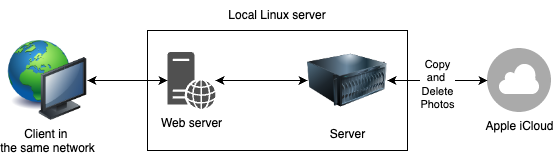

# Transfer iCloud Photos To Ubuntu Server (Filtered by DETR Model)

## Overview
This project copies wanted photos and deletes unwanted photos from iCloud to a local Ubuntu Server (Raspberry Pi) with default saving for photos recognized as containing 'human' objects. The system utilizes [Facebook DETR-resnet-50 model](https://huggingface.co/facebook/detr-resnet-50) to identify and categorize objects, saving time by focusing on photos with human subjects. The motivation behind this project is partly driven by the high costs associated with iCloud storage, providing an economical alternative for managing the photo library.

## Features
1. **Object Identification with threadings:**
   - Utilizes the DETR model to recognize and categorize objects within the photos with Python threading to improve computating time by 25%.
2. **iCloud Integration:**
    - Fetch photos from your iCloud storage.
3. **Web UI:**
   - A web UI is developed for better UX.
3. **Automatic Sorting:**
   - Photos are automatically organized based on the identified objects.
4. **Local Hosting:**
   - Transfers and stores photos locally on a Raspberry Pi running Ubuntu Server.

## Requirements
- A computer running Ubuntu Server 20.04 LTS
- iCloud account credentials
- Python environment with necessary dependencies

## Run Locally
1. Clone the project
```bash
  git clone https://github.com/yhmyhm0910/iCloudPhotoToLocal-DETR
```
2. Go to the project directory
```bash
  cd iCloudPhotoToUbuntuServerDETR
```
3. Install dependencies for server
```bash
  cd server
  npm install
```
4. Create a file name `.env` at `/server` and set 
```bash
  PORT={your port number}
  JWT_SECRET_KEY={your JWT secret key}
```
5. Start the server
```bash
  yarn start
```
6. Install dependencies for web client
```bash
  cd ..
  cd web
  npm install
```
7. Start the web server
```bash
  yarn start
```
8. Follow the instructions on the web UI. Wanted image will finally be stored at both `/server/saved_images` locally and iCloud.

## Demo
Video demo can be found [here](LICENSE).

## System Architecture
1. **Local Server**
    - Perform object detections
    - Save images
    - Login and copy/delete photos from iCloud
2. **Web Server**
    - Provide UI



## Limitation
1. Videos cannot be processed.
2. Significant high usage of both CPU and RAM when object identifying many images.

## Contributing
Feel free to contribute to the project by opening issues, submitting feature requests, or creating pull requests. Your feedback and contributions are highly appreciated!

## License
This project is licensed under the [MIT License](LICENSE).